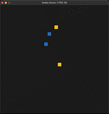

# 2-Snake

This is my Capstone project for the [Udacity C++ Nanodegree Program](https://www.udacity.com/course/c-plus-plus-nanodegree--nd213).

The code for this repo was inspired by [this](https://codereview.stackexchange.com/questions/212296/snake-game-in-c-with-sdl) excellent StackOverflow post and set of responses.

Tip-> Turn on audio in the video below:

https://user-images.githubusercontent.com/11140296/218392847-a9a6b559-c0e3-4b99-8d68-3e8dce51071a.mp4

The game is a twist on the classic game of Snake. In this version, there are two snakes, not one. A snake will die when it runs into its own tail or the other snake. The score is the minimum of either snake's size - this encourages you to play with both snakes, not just one.

## Notice to Reviewer
You will need to install `sudo apt-get install libsdl2-ttf-dev` to run.

## Rubric Points Addressed
* The project uses multiple threads in the execution (main.cpp:22)
  * Audio is run in a seperate thread (note - the audio won't play over VNC, but see the video above to hear it in action)
* The project uses smart pointers instead of raw pointers (e.g. game.cpp:13)
  * Snake objects are referenced via unique_ptr
* For classes with move constructors, the project returns objects of that class by value, and relies on the move constructor, instead of copying the object (e.g. game.cpp:16)
* At least two variables are defined as references, or two functions use pass-by-reference in the project code (e.g. Game::PlaceFood, Snake::CheckCollision)
* The project code is organized into classes with class attributes to hold the data, and class methods to perform tasks (e.g. Audio.h/Audio.cpp)
* All class data members are explicitly specified as public, protected, or private (e.g. Audio.h/Audio.cpp)
* The project follows the Resource Acquisition Is Initialization pattern where appropriate, by allocating objects at compile-time, initializing objects when they are declared, and utilizing scope to ensure their automatic destruction.
  * Objects are allocated on the stack and released when exiting scope (e.g. thread on main.cpp:22)
* All class members that are set to argument values are initialized through member initialization lists (e.g. Renderer.cpp:8, Snake.cpp:11)

## Dependencies for Running Locally
* cmake >= 3.7
  * All OSes: [click here for installation instructions](https://cmake.org/install/)
* make >= 4.1 (Linux, Mac), 3.81 (Windows)
  * Linux: make is installed by default on most Linux distros
  * Mac: [install Xcode command line tools to get make](https://developer.apple.com/xcode/features/)
  * Windows: [Click here for installation instructions](http://gnuwin32.sourceforge.net/packages/make.htm)
* SDL2 >= 2.0
  * All installation instructions can be found [here](https://wiki.libsdl.org/Installation)
  >Note that for Linux, an `apt` or `apt-get` installation is preferred to building from source. 
* SDL2-ttf
  * Linux: `sudo apt-get install libsdl2-ttf-dev`
  * Mac (via Homebrew): `brew install sdl2_ttf`
* gcc/g++ >= 5.4
  * Linux: gcc / g++ is installed by default on most Linux distros
  * Mac: same deal as make - [install Xcode command line tools](https://developer.apple.com/xcode/features/)
  * Windows: recommend using [MinGW](http://www.mingw.org/)
* Run on a device with audio to hear the music

## Basic Build Instructions

1. Clone this repo.
2. Make a build directory in the top level directory: `mkdir build && cd build`
3. Compile: `cmake .. && make`
4. Run it: `./SnakeGame`.

## Acknowledgements
* `FindSDL2_ttf.cmake` taken from [here](https://github.com/tcbrindle/sdl2-cmake-scripts/blob/master/FindSDL2_ttf.cmake)
* Instructions from using the above script found [here](https://github.com/tcbrindle/sdl2-cmake-scripts)
* SDL audio implementation inspired by [this](https://gist.github.com/armornick/3447121)
* Soundtrack:
Aggressive Computer Gaming | ENIGMA by Alex-Productions | https://onsound.eu/
Music promoted by https://www.chosic.com/free-music/all/
Creative Commons CC BY 3.0
https://creativecommons.org/licenses/by/3.0/

## CC Attribution-ShareAlike 4.0 International

Shield: [![CC BY-SA 4.0][cc-by-sa-shield]][cc-by-sa]

This work is licensed under a
[Creative Commons Attribution-ShareAlike 4.0 International License][cc-by-sa].

[![CC BY-SA 4.0][cc-by-sa-image]][cc-by-sa]

[cc-by-sa]: http://creativecommons.org/licenses/by-sa/4.0/
[cc-by-sa-image]: https://licensebuttons.net/l/by-sa/4.0/88x31.png
[cc-by-sa-shield]: https://img.shields.io/badge/License-CC%20BY--SA%204.0-lightgrey.svg
